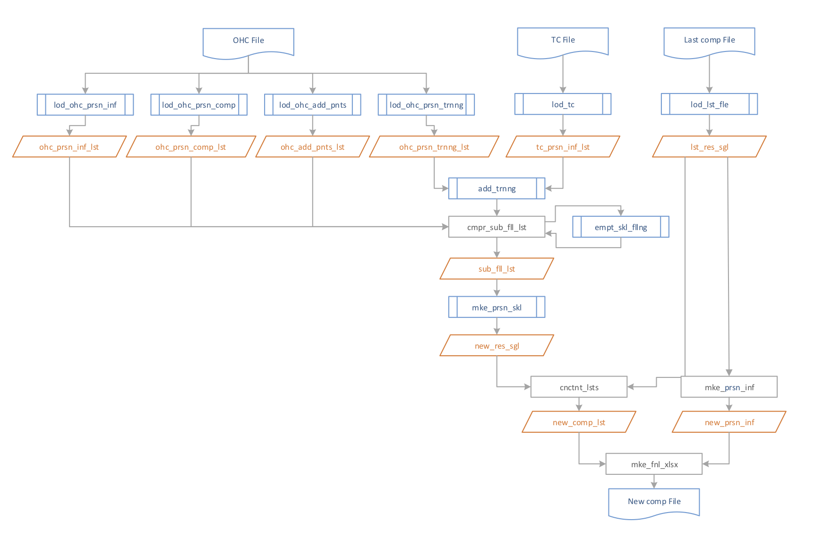

# Competence uploading

This scrip read some xlsx files, processes information using algorithm and creates a new file of the required form.

Algorithm diagram:

This project was made with [openpyxl](https://openpyxl.readthedocs.io/en/stable/) lib v2.5.3